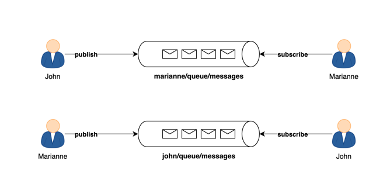
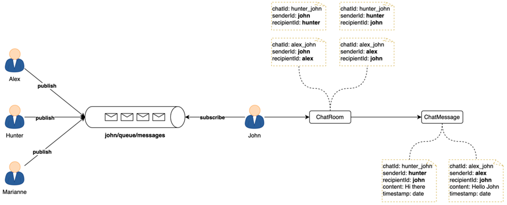
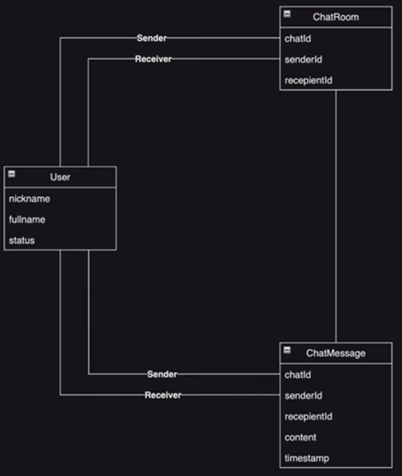
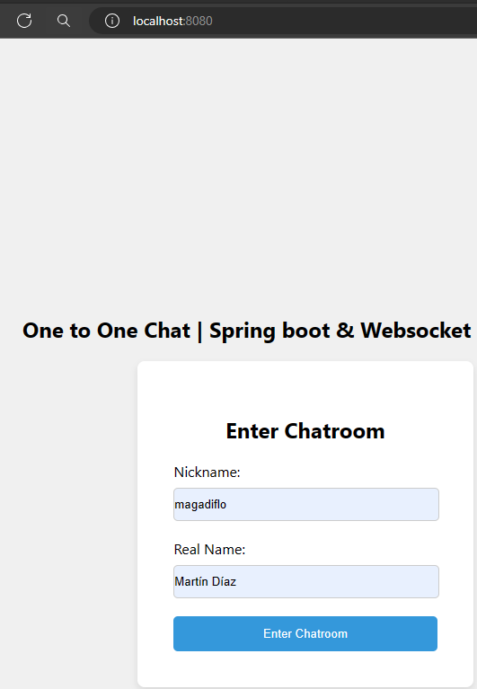
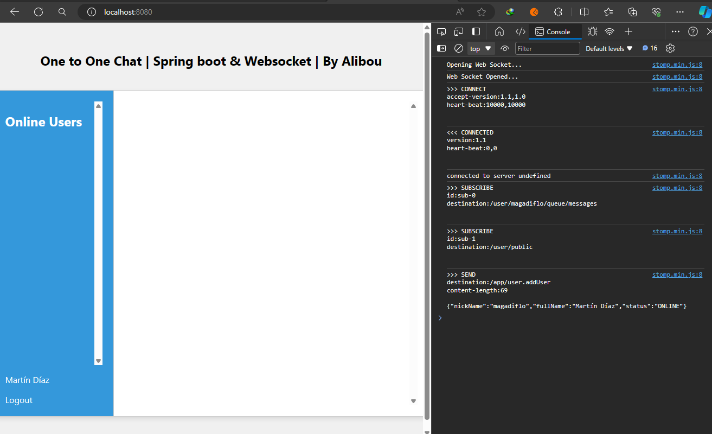
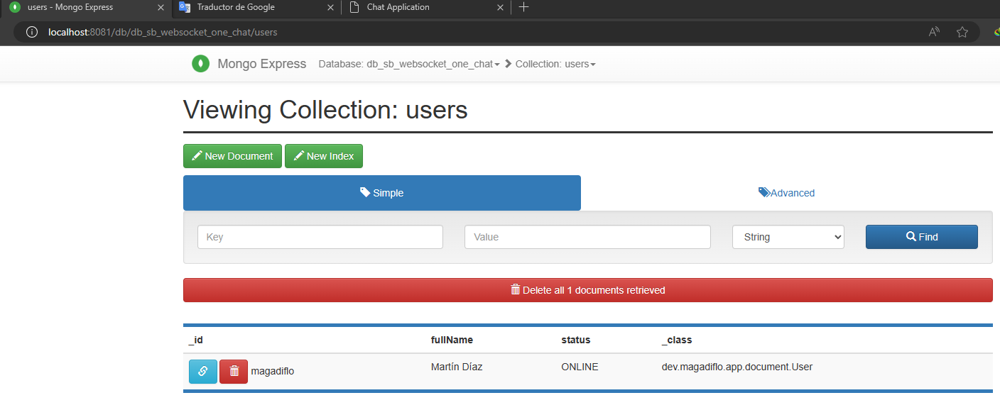
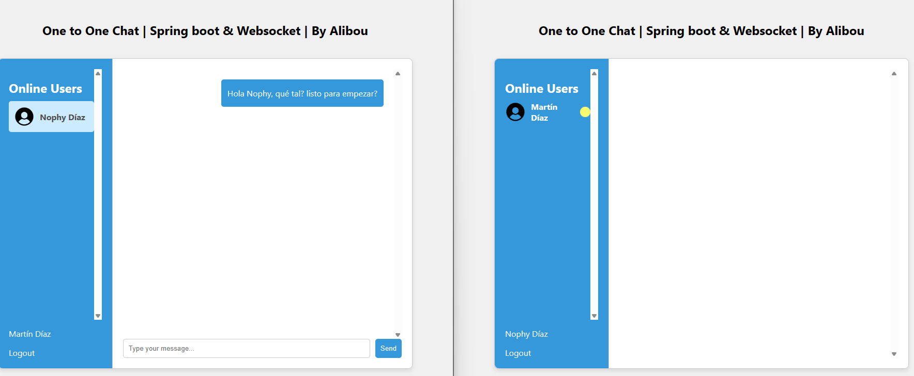
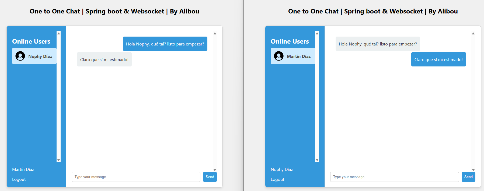

# [Tutorial de WebSocket con Spring Boot | Cree una aplicación de chat uno a uno](https://www.youtube.com/watch?v=7T-HnTE6v64)

Tutorial tomado del canal de **Bouali Ali**

- [Tutorial previo donde se construye un chat grupal](https://github.com/magadiflo/spring_boot_websocket_chat.git)

---

## Visión general - Comunicación uno a uno

En el siguiente diagrama se muestra una comunicación de uno a uno, donde `John` publica o envía un mensaje a `Marianne`
y `Marianne` **se subscribe a su propia cola (queue)** en donde va a recibir los mensajes.

En el otro sentido sería algo similar, `Marianne` envía mensaje a `John` y `John` **se subscribe a su propia cola** en
donde va a recibir los mensajes.



## Flujo del chat de uno a uno

En el siguiente diagrama vemos la comunicación que se establece entre distintos usuarios con el usuario `John`.

Veamos la comunicación entre `Hunter` y `John`. Esa comunicación genera un `chatId`: `hunter_john`, en ese chatId
existe dos flujos, la primera cuando el `senderId`: `John` (quien envía el mensaje) y el `recipientId`: `Hunter` (quien
recibe el mensaje). En el siguiente flujo se intercambian los papeles, ahora `senderId`: `Hunter` y
el `recipientId`: `John`.

Finalmente, se tiene un `ChatMessage` donde se tienen los siguientes atributos: **chatId, senderId, recipientId, content
y timestamp.**



## Diagrama de la relación entre los documentos

En este proyecto usaremos MongoDb como base de datos no relacional, por lo tanto, sabemos bien que en esta base de datos
no existen relaciones, pero la imagen que se muestra a continuación es una manera de ver cómo es que se van a
vincular los documentos.



---

## Dependencias

````xml
<!--Spring Boot 3.2.4-->
<!--Java 21-->
<dependencies>
    <dependency>
        <groupId>org.springframework.boot</groupId>
        <artifactId>spring-boot-starter-data-mongodb</artifactId>
    </dependency>
    <dependency>
        <groupId>org.springframework.boot</groupId>
        <artifactId>spring-boot-starter-web</artifactId>
    </dependency>
    <dependency>
        <groupId>org.springframework.boot</groupId>
        <artifactId>spring-boot-starter-websocket</artifactId>
    </dependency>

    <dependency>
        <groupId>org.projectlombok</groupId>
        <artifactId>lombok</artifactId>
        <optional>true</optional>
    </dependency>
    <dependency>
        <groupId>org.springframework.boot</groupId>
        <artifactId>spring-boot-starter-test</artifactId>
        <scope>test</scope>
    </dependency>
</dependencies>
````

## MongoDB - Contenedor

Trabajaremos con la base de datos `mongodb`, para eso creamos su servicio con sus configuraciones correspondientes.
Además, crearemos un servicio adicional con el que podremos interactuar con la base de datos de mongo,
ese servicio será `mongo-express`, aunque en mi computadora tengo instalado el `Studio-3T` que es lo mismo que usaría
para poder interactura con la base de datos de mongo.

````yml
services:
  mongodb:
    image: mongo:6-jammy
    container_name: mongo_db
    restart: unless-stopped
    ports:
      - 27017:27017
    volumes:
      - mongo:/data/db
    environment:
      MONGO_INITDB_ROOT_USERNAME: magadiflo
      MONGO_INITDB_ROOT_PASSWORD: magadiflo
  mongo-express:
    image: mongo-express
    container_name: mongo_express
    restart: unless-stopped
    ports:
      - 8081:8081
    environment:
      ME_CONFIG_MONGODB_ADMINUSERNAME: magadiflo
      ME_CONFIG_MONGODB_ADMINPASSWORD: magadiflo
      ME_CONFIG_MONGODB_SERVER: mongodb
volumes:
  mongo:
    name: mongo
````

**IMPORTANTE**

Para poder usar `mongo-express` en el navegador ingresamos mediante la siguiente url: `http://localhost:8081`:

- **username:** admin
- **password:** `pass`

## Configurando application.yml

````yml
server:
  port: 8080
  error:
    include-message: always

spring:
  application:
    name: sb-websocket-one-chat

  data:
    mongodb:
      username: magadiflo
      password: magadiflo
      host: localhost
      port: 27017
      database: db_sb_websocket_one_chat
      authentication-database: admin
````

## Configurando WebSocket

`registry.addEndpoint("/web-socket")`, registre un endpoint `STOMP` sobre `WebSocket` en la ruta de mapeo proporcionada.
Este endpoint será el que usaremos cuando iniciemos la conexión con WebSocket desde la aplicación cliente al Servidor.

`registry.enableSimpleBroker("/user")`, habilite un **intermediario de mensajes simple (simple message broker)** y
configure uno o más prefijos para filtrar destinos dirigidos al **intermediario (broker)** (por ejemplo, destinos con el
prefijo `/topic`). En nuestro caso, el prefijo definido será `/user`.

`registry.setApplicationDestinationPrefixes("/app")`, configure uno o más prefijos para filtrar destinos dirigidos a
métodos anotados en la aplicación. Por ejemplo, los destinos con el prefijo `/app` pueden procesarse mediante métodos
anotados, mientras que otros destinos pueden apuntar al intermediario de mensajes (por ejemplo, `/topic`, `/queue`).
Cuando se procesan mensajes, el prefijo coincidente se elimina del destino para formar la ruta de búsqueda. Esto
significa que las anotaciones no deben contener el prefijo de destino.
A los prefijos que no tengan una barra diagonal se les agregará una automáticamente.

`registry.setUserDestinationPrefix("/user")`, configure el prefijo utilizado para identificar los destinos de los
usuarios. Los destinos de usuario brindan la posibilidad de que un usuario se suscriba a nombres de cola exclusivos de
su sesión, así como de que otros envíen mensajes a esas colas únicas y específicas del usuario.
Por ejemplo, cuando un usuario intenta suscribirse a `/user/queue/position-updates`, el destino puede traducirse
a `/queue/position-updates-useri9oqdfzo`, lo que genera un nombre de cola único que no colisiona con ningún otro usuario
que intente hacer lo mismo. Posteriormente, cuando los mensajes se envían a `/user/{username}/queue/position-updates`,
el destino se traduce a `/queue/position-updates-useri9oqdfzo`.
El prefijo predeterminado utilizado para identificar dichos destinos es `/user/`.

````java

@Configuration
@EnableWebSocketMessageBroker
public class WebSocketConfig implements WebSocketMessageBrokerConfigurer {
    @Override
    public void registerStompEndpoints(StompEndpointRegistry registry) {
        registry.addEndpoint("/web-socket") // Registrar un punto de conexión WebSocket
                .setAllowedOriginPatterns("*")
                .withSockJS();
    }

    @Override
    public boolean configureMessageConverters(List<MessageConverter> messageConverters) {
        DefaultContentTypeResolver resolver = new DefaultContentTypeResolver();
        resolver.setDefaultMimeType(MimeTypeUtils.APPLICATION_JSON);

        MappingJackson2MessageConverter converter = new MappingJackson2MessageConverter();
        converter.setObjectMapper(new ObjectMapper());
        converter.setContentTypeResolver(resolver);

        messageConverters.add(converter);
        return false; // No queremos usar los valores predeterminados sino el que acabamos de configurar
    }

    @Override
    public void configureMessageBroker(MessageBrokerRegistry registry) {
        registry.enableSimpleBroker("/user");               // Habilita un broker simple
        registry.setApplicationDestinationPrefixes("/app"); // Prefijo para los destinos de la aplicación
        registry.setUserDestinationPrefix("/user");         // Prefijo para los destinos de usuario
    }
}
````

El método `configureMessageConverters()`, permite configurar los convertidores de mensajes que se utilizarán al extraer
la carga útil de los mensajes en métodos anotados y al enviar mensajes (por ejemplo, a través del "intermediario"
SimpMessagingTemplate).

La lista proporcionada, inicialmente vacía, se puede usar para agregar convertidores de mensajes, mientras que el valor
de retorno booleano se usa para determinar si también se debe agregar el mensaje predeterminado.

````
Parámetros:
messageConverters: los convertidores a configurar (inicialmente una lista vacía)

Devoluciones:
si agregar también el convertidor predeterminado o no
````

## Document User

Será como nuestra entidad, pero como estamos trabajando con MongoDb será nuestro documento que estará mapeado a la
colección `users` en la base de datos de mongoDB.

````java
public enum Status {
    ONLINE,
    OFFLINE
}
````

````java

@Getter
@Setter
@Document(collection = "users")
public class User {
    @Id
    private String nickName;
    private String fullName;
    private Status status;
}
````

## Repositorio

````java
public interface UserRepository extends MongoRepository<User, String> {
    List<User> findAllByStatus(Status status);
}
````

## Servicio

````java
public interface UserService {
    void saveUser(User user);

    void disconnect(User user);

    List<User> findConnectedUsers();
}
````

````java

@RequiredArgsConstructor
@Service
public class UserServiceImpl implements UserService {

    private final UserRepository userRepository;

    @Override
    public void saveUser(User user) {
        user.setStatus(Status.ONLINE);
        this.userRepository.save(user);
    }

    @Override
    public void disconnect(User user) {
        Optional<User> userDBOptional = this.userRepository.findById(user.getNickName());
        if (userDBOptional.isPresent()) {
            User userDB = userDBOptional.get();
            userDB.setStatus(Status.OFFLINE);
            this.userRepository.save(userDB);
        }
    }

    @Override
    public List<User> findConnectedUsers() {
        return this.userRepository.findAllByStatus(Status.ONLINE);
    }
}
````

## Controlador de usuario

````java

@RequiredArgsConstructor
@Controller
public class UserController {

    private final UserService userService;

    @MessageMapping("/user.addUser")
    @SendTo("/user/public") // Para informar que un nuevo usuario se ha conectado. Esta cola será creado automáticamente
    public User addUser(@Payload User user) {
        this.userService.saveUser(user);
        return user;
    }

    @MessageMapping("/user.disconnectUser")
    @SendTo("/user/public") // Notificaremos a la misma cola que algún usuario está desconectado
    public User disconnect(@Payload User user) {
        this.userService.disconnect(user);
        return user;
    }

    @GetMapping(path = "/users")
    public ResponseEntity<List<User>> findConnectedUsers() {
        return ResponseEntity.ok(this.userService.findConnectedUsers());
    }
}
````

## Document ChatRoom

````java

@Getter
@Setter
@AllArgsConstructor
@NoArgsConstructor
@Builder
@Document(collection = "chat_rooms")
public class ChatRoom {
    @Id
    private String id;
    private String chatId;
    private String senderId;
    private String recipientId;
}
````

## ChatRoomRepository

````java
public interface ChatRoomRepository extends MongoRepository<ChatRoom, String> {
    Optional<ChatRoom> findBySenderIdAndRecipientId(String senderId, String recipientId);
}
````

## ChatRoomService

````java
public interface ChatRoomService {
    Optional<String> getChatRoomId(String senderId, String recipientId, boolean createNewRoomIfNotExists);
}
````

````java

@RequiredArgsConstructor
@Service
public class ChatRoomServiceImpl implements ChatRoomService {

    private final ChatRoomRepository chatRoomRepository;

    @Override
    public Optional<String> getChatRoomId(String senderId, String recipientId, boolean createNewRoomIfNotExists) {
        return this.chatRoomRepository.findBySenderIdAndRecipientId(senderId, recipientId)
                .map(ChatRoom::getChatId)
                .or(() -> {
                    if (createNewRoomIfNotExists) {
                        String chatId = this.createChatId(senderId, recipientId);
                        return Optional.of(chatId);
                    }
                    return Optional.empty();
                });
    }

    private String createChatId(String senderId, String recipientId) {
        String chatId = String.format("%s_%s", senderId, recipientId);

        // Para crear dos salas de chat (chat room), uno para el sender y otro para el recipient
        ChatRoom senderRecipient = ChatRoom.builder()
                .chatId(chatId)
                .senderId(senderId)
                .recipientId(recipientId)
                .build();

        ChatRoom recipientSender = ChatRoom.builder()
                .chatId(chatId)
                .senderId(recipientId)
                .recipientId(senderId)
                .build();

        this.chatRoomRepository.save(senderRecipient);
        this.chatRoomRepository.save(recipientSender);

        return chatId;
    }
}
````

## ChatMessage

````java

@Getter
@Setter
@AllArgsConstructor
@NoArgsConstructor
@Builder
@Document(collection = "chat_messages")
public class ChatMessage {
    @Id
    private String id;
    private String chatId;
    private String senderId;
    private String recipientId;
    private String content;
    private Date timestamp;
}
````

````java
public record ChatNotification(String id, String senderId, String recipientId, String content) {
}
````

## ChatMessageRepository

````java
public interface ChatMessageRepository extends MongoRepository<ChatMessage, String> {
    List<ChatMessage> findByChatId(String chatId);
}
````

## ChatMessageService

````java
public interface ChatMessageService {
    List<ChatMessage> findChatMessages(String senderId, String recipientId);

    ChatMessage save(ChatMessage chatMessage);
}
````

````java

@RequiredArgsConstructor
@Service
public class ChatMessageServiceImpl implements ChatMessageService {

    private final ChatMessageRepository chatMessageRepository;
    private final ChatRoomService chatRoomService;

    @Override
    public List<ChatMessage> findChatMessages(String senderId, String recipientId) {
        return this.chatRoomService.getChatRoomId(senderId, recipientId, false)
                .map(this.chatMessageRepository::findByChatId)
                .orElseGet(ArrayList::new);
    }

    @Override
    public ChatMessage save(ChatMessage chatMessage) {
        String chatId = this.chatRoomService.getChatRoomId(chatMessage.getSenderId(), chatMessage.getRecipientId(), true)
                .orElseThrow();
        chatMessage.setChatId(chatId);
        this.chatMessageRepository.save(chatMessage);
        return chatMessage;
    }
}
````

## ChatController

````java

@RequiredArgsConstructor
@Controller
public class ChatController {

    private final SimpMessagingTemplate simpMessagingTemplate;
    private final ChatMessageService chatMessageService;

    @MessageMapping("/chat")
    public void processMessage(@Payload ChatMessage chatMessage) {
        ChatMessage chatMessageDB = this.chatMessageService.save(chatMessage);
        ChatNotification payload = new ChatNotification(
                chatMessageDB.getId(),
                chatMessageDB.getSenderId(),
                chatMessageDB.getRecipientId(),
                chatMessageDB.getContent()
        );

        /**
         * Enviando mensaje a un usuario específico
         * ****************************************
         * Queremos enviar el payload a la cola de abajo.
         * Vemos que el método convertAndSendToUser tiene los siguientes parámetros, de los cuales nos interesa los
         * dos primeros para poder ver cómo es que se genera la cola:
         * (chatMessage.getRecipientId(), "/queue/messages", payload)
         *
         * Para nuestro ejemplo el getRecipientId() será el usuario magadiflo, entonces a eso le debemos concatenar
         * el siguiente valor del parámetro /queue/messages dando como resultado la siguiente cola:
         * magadiflo/queue/messages
         *
         * Luego magadiflo, se subscribirá a la cola magadiflo/queue/messages.
         *
         * El payload enviado a través de este destino "/queue/messages" se envía solo al usuario magadiflo, donde
         * magadiflo se obtiene de chatMessage.getRecipientId()
         */
        this.simpMessagingTemplate.convertAndSendToUser(chatMessage.getRecipientId(), "/queue/messages", payload);
    }

    @GetMapping("/messages/{senderId}/{recipientId}")
    public ResponseEntity<List<ChatMessage>> findChatMessages(@PathVariable String senderId, @PathVariable String recipientId) {
        return ResponseEntity.ok(this.chatMessageService.findChatMessages(senderId, recipientId));
    }
}
````

---

# FrontEnd

---

## Vista HTML

A continuación se muestra la estructura html del chat. Como primera ventana se muestra el formulario para ingresar
el `nikName` y el `fullName`.

Notar que estamos haciendo uso de las librerías `sockjs.min.js` y `stomp.min.js` para poder realizar la conexión
`webSocket`. Estas librerías las usaremos en nuestro archivo de javascript personalizado `scripts.js`.

````html
<!DOCTYPE html>
<html lang="en">

<head>
    <meta charset="UTF-8">
    <meta name="viewport" content="width=device-width, initial-scale=1.0">
    <link rel="stylesheet" href="./css/styles.css">
    <title>Chat Application</title>
</head>

<body>

<h2>One to One Chat | Spring boot & Websocket | By Alibou</h2>

<div class="user-form" id="username-page">
    <h2>Enter Chatroom</h2>
    <form id="usernameForm">
        <label for="nickname">Nickname:</label>
        <input type="text" id="nickname" name="nickname" required>

        <label for="fullname">Real Name:</label>
        <input type="text" id="fullname" name="realname" required>

        <button type="submit">Enter Chatroom</button>
    </form>
</div>

<div class="chat-container hidden" id="chat-page">
    <div class="users-list">
        <div class="users-list-container">
            <h2>Online Users</h2>
            <ul id="connectedUsers">
            </ul>
        </div>
        <div>
            <p id="connected-user-fullname"></p>
            <a class="logout" href="javascript:void(0)" id="logout">Logout</a>
        </div>
    </div>

    <div class="chat-area">
        <div class="chat-area" id="chat-messages">
        </div>

        <form id="messageForm" name="messageForm" class="hidden">
            <div class="message-input">
                <input autocomplete="off" type="text" id="message" placeholder="Type your message...">
                <button>Send</button>
            </div>
        </form>
    </div>
</div>

<script src="https://cdnjs.cloudflare.com/ajax/libs/sockjs-client/1.1.4/sockjs.min.js"></script>
<script src="https://cdnjs.cloudflare.com/ajax/libs/stomp.js/2.3.3/stomp.min.js"></script>
<script src="./js/scripts.js"></script>
</body>

</html>
````

## Implementando Script

````javascript
'use strict';

const usernamePage = document.querySelector('#username-page');
const chatPage = document.querySelector('#chat-page');
const usernameForm = document.querySelector('#usernameForm');
const messageForm = document.querySelector('#messageForm');
const messageInput = document.querySelector('#message');
const connectingElement = document.querySelector('.connecting');
const chatArea = document.querySelector('#chat-messages');
const logout = document.querySelector('#logout');

let stompClient = null;
let nickname = null;
let fullname = null;
let selectedUserId = null;

/**
 * * Lo primero que debemos hacer cuando trabajamos con WebSockets y Stomp
 * * es conectar a nuestro usuario al WebSocket de nuestro sitio web.
 */
function connect(event) {
    nickname = document.querySelector('#nickname').value.trim();
    fullname = document.querySelector('#fullname').value.trim();

    if (nickname && fullname) {
        usernamePage.classList.add('hidden');
        chatPage.classList.remove('hidden');
        /**
         * * Conectándonos al WebSocket
         * * **************************
         * * /web-socket, es el endpoint que definimos en WebSocketConfig del backend.
         * * 
         * * NOTA: Si nuestro frontend estuviera desplegado en otro servidor, y el backend
         * * estuviera corriendo en el puerto, por ejemplo 3000, deberíamos colocar
         * * la url de conexión TCP completa del backend. 
         * * Ejemplo: '//localhost:3000/web-socket' // Conexión TCP, no es conexión HTTP
         * *
         * * NOTA: Como el frontEnd está corriendo en el mismo servidor del backend, entonces
         * * usamos directamente el /web-socket
        */
        const socket = new SockJS('/web-socket');
        stompClient = Stomp.over(socket);

        stompClient.connect({}, onConnected, onError);
    }
    event.preventDefault();
}

function onConnected() {
    /**
     * * Subscribiéndonos a distintos eventos
     * * ************************************
     * * El usuario deberá subscribirse a su propia cola, para que cada vez que reciba un mensaje
     * * sea notificado.
     */
    stompClient.subscribe(`/user/${nickname}/queue/messages`, onMessageReceived);
    stompClient.subscribe(`/user/public`, onMessageReceived);

    /**
     * * Registrar al usuario conectado
     */
    const payload = JSON.stringify({ nickName: nickname, fullName: fullname, status: 'ONLINE' });
    stompClient.send('/app/user.addUser', {}, payload);

    document.querySelector('#connected-user-fullname').textContent = fullname;
    //* Buscar y mostrar los usuarios conectados
    findAndDisplayConnectedUsers().then();
}

async function findAndDisplayConnectedUsers() {
    const connectedUserResponse = await fetch('/users');
    let connectedUsers = await connectedUserResponse.json();
    connectedUsers = connectedUsers.filter(user => user.nickName !== nickname);

    const ulElementConnectedUsers = document.getElementById('connectedUsers');
    ulElementConnectedUsers.innerHTML = '';

    connectedUsers.forEach(user => {
        appendUserElement(user, ulElementConnectedUsers);
        if (connectedUsers.indexOf(user) < connectedUsers.length - 1) {
            //* Agrega un separador
            const separator = document.createElement('li');
            separator.classList.add('separator');
            ulElementConnectedUsers.appendChild(separator);
        }
    });

}

function appendUserElement(user, connectedUsersList) {
    const listItem = document.createElement('li');
    listItem.classList.add('user-item');
    listItem.id = user.nickName;

    const userImage = document.createElement('img');
    userImage.src = '../img/user_icon.png';
    userImage.alt = user.fullName;

    const usernameSpan = document.createElement('span');
    usernameSpan.textContent = user.fullName;

    const receivedMsgs = document.createElement('span');
    receivedMsgs.textContent = '0';
    receivedMsgs.classList.add('nbr-msg', 'hidden');

    listItem.appendChild(userImage);
    listItem.appendChild(usernameSpan);
    listItem.appendChild(receivedMsgs);

    listItem.addEventListener('click', userItemClick);

    connectedUsersList.appendChild(listItem);
}

function userItemClick(event) {
    document.querySelectorAll('.user-item').forEach(item => {
        item.classList.remove('active');
    });
    messageForm.classList.remove('hidden');

    const clickedUser = event.currentTarget;
    clickedUser.classList.add('active');

    selectedUserId = clickedUser.getAttribute('id');
    fetchAndDisplayUserChat().then();

    const nbrMsg = clickedUser.querySelector('.nbr-msg');
    nbrMsg.classList.add('hidden');
    nbrMsg.textContent = '0';
}

async function fetchAndDisplayUserChat() {
    const userChatResponse = await fetch(`/messages/${nickname}/${selectedUserId}`);
    const userChat = await userChatResponse.json();
    chatArea.innerHTML = '';
    userChat.forEach(chat => {
        displayMessage(chat.senderId, chat.content);
    });
    chatArea.scrollTop = chatArea.scrollHeight;
}

function displayMessage(senderId, content) {
    console.log('Mostrando mensaje!');
    console.log({ senderId, content });
    const messageContainer = document.createElement('div');
    messageContainer.classList.add('message');
    if (senderId === nickname) {
        messageContainer.classList.add('sender');
    } else {
        messageContainer.classList.add('receiver');
    }
    const message = document.createElement('p');
    message.textContent = content;
    messageContainer.appendChild(message);
    chatArea.appendChild(messageContainer);
}

function onError() {
    connectingElement.textContent = 'No se pudo conectar al servidor WebSocket. ¡Actualice esta página para volver a intentarlo!';
    connectingElement.style.color = 'red';
}

async function onMessageReceived(payload) {
    await findAndDisplayConnectedUsers();
    console.log('Message received', payload);

    const message = JSON.parse(payload.body);
    if (selectedUserId && selectedUserId === message.senderId) {
        displayMessage(message.senderId, message.content);
        chatArea.scrollTop = chatArea.scrollHeight;
    }

    if (selectedUserId) {
        document.querySelector(`#${selectedUserId}`).classList.add('active');
    } else {
        messageForm.classList.add('hidden');
    }

    const notifiedUser = document.querySelector(`#${message.senderId}`);
    if (notifiedUser && !notifiedUser.classList.contains('active')) {
        const nbrMsg = notifiedUser.querySelector('.nbr-msg');
        nbrMsg.classList.remove('hidden');
        nbrMsg.textContent = '';
    }
}

function sendMessage(event) {
    const messageContent = messageInput.value.trim();
    if (messageContent && stompClient) {
        const chatMessage = {
            senderId: nickname,
            recipientId: selectedUserId,
            content: messageContent,
            timestamp: new Date()
        };
        stompClient.send("/app/chat", {}, JSON.stringify(chatMessage));
        displayMessage(nickname, messageContent);
        messageInput.value = '';
    }
    chatArea.scrollTop = chatArea.scrollHeight;
    event.preventDefault();
}

function onLogout() {
    const payload = JSON.stringify({ nickName: nickname, fullName: fullname, status: 'OFFLINE' });
    stompClient.send('/app/user.disconnectUser', {}, payload);
    window.location.reload();
}

/**
 * * Cuando estableces el tercer parámetro en true, como en tu ejemplo:
 * * ******************************************************************
 * * Estás indicando que deseas que el evento se capture durante la fase de captura. 
 * * La fase de captura es la primera fase del flujo de eventos en el DOM, en la que el 
 * * evento se maneja desde el elemento raíz hasta el elemento objetivo. Esto significa que, 
 * * en este caso, cuando se envíe el formulario (submit), se capturará el evento en el 
 * * camino hacia el elemento específico al que está asociado el evento (usernameForm), 
 * * independientemente de en qué elemento exacto ocurra el evento de envío del formulario.
 * *
 * * Por lo tanto, cuando establecemos en true, el evento lo maneja desde el elemento raíz hacia el objetivo.
 * *
 * * Si pasas false o simplemente omites este parámetro, el evento se manejará durante la fase de burbujeo, que 
 * * es la fase en la que el evento se propaga desde el elemento objetivo hasta el elemento raíz.
 */
usernameForm.addEventListener('submit', connect, true);
messageForm.addEventListener('submit', sendMessage, true);
logout.addEventListener('click', onLogout, true);
//* Si el usuario actualiza la página, le haremos el logout
window.onbeforeunload = () => onLogout();
````

## Ejecutando aplicación

### Creando ventana de chat

En este punto crearemos un chat para el usuario `magadiflo`. Para eso simplementa ingresamos a la
url `http://localhost:8080`:



### Ingresando a ventana de chat

Acabamos de ingresar con el usuario magadiflo, veamos en el log del navegador la secuencia de instrucciones ejecutadas
para conectarnos y subscribirmos al websocket del backend.



### Base de datos MongoDB

Anteriormente hemos ingresadoc on el usuario `magadiflo`, en automático, si la base de datos no está creada, nuestra
aplicación de Spring Boot creará por nosotros la base de datos e incluso los documentos donde almacenará los usuarios.

Es importante tener en cuenta que cuando ingresemos a la base de datos mediante el navegador debemos hacer uso de
un usuario y contraseña: `admin` y `pass`.

Recordar que los datos de conexión están definidos en el `application.yml` y también en el `compose.yml`.



### Enviando mensaje entre usuarios

Observemos que con el usuario `magadiflo` hemos enviado mensaje al usuario `nophy`. El usuario `nophy` aún no ha abierto
el mensaje que le ha llegado, por eso es que aparece un círculo amarillo en el chat.



### Comunicacíon entre usuarios

